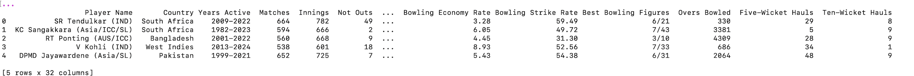
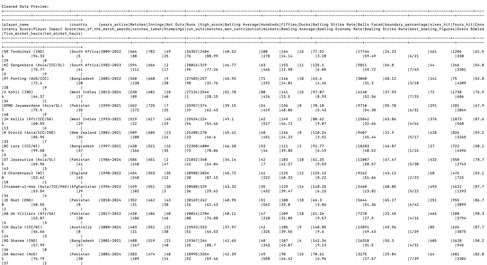
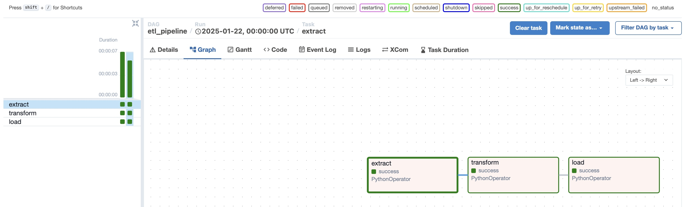
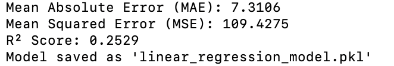
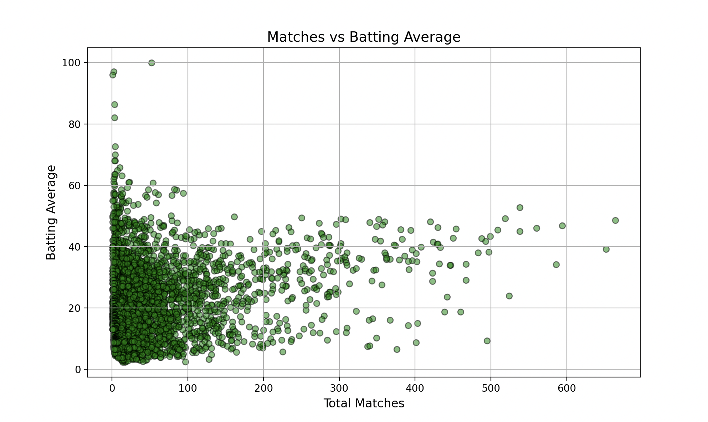
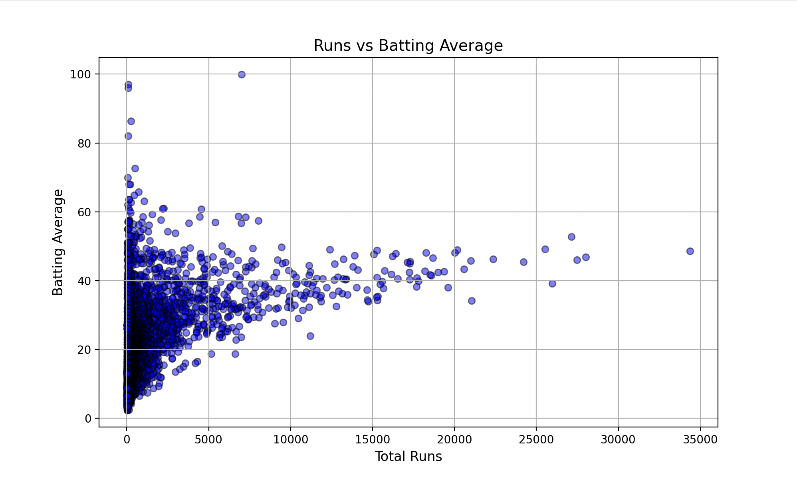
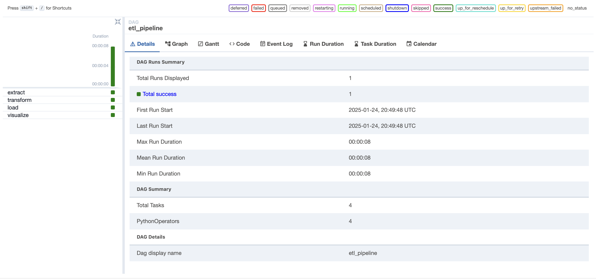
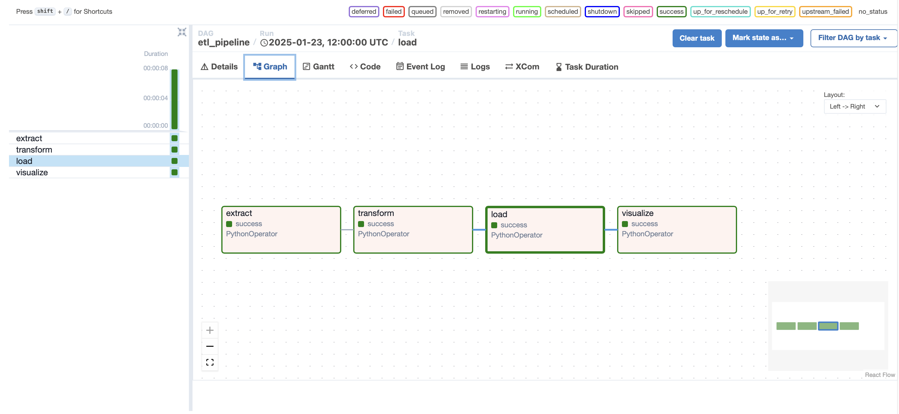

# **Cricket Player Analysis - Data Engineering & Machine Learning Project** 🏏📊🚀

## **Project Overview**

This project implements a **complete end-to-end data pipeline** using **Apache Spark, PostgreSQL, Apache Airflow, and Machine Learning** to analyze **cricket player performance**. The pipeline includes **data extraction, transformation, storage, automation, machine learning model training, and visualization**.

---

## **Project Workflow**

1. **Extract Data** → Load CSV into **Pandas & PostgreSQL**.  
2. **Transform Data** → Clean & Process using **Apache Spark**.  
3. **Load Data** → Store transformed data into **PostgreSQL**.  
4. **Automate Workflow** → Use **Apache Airflow DAGs**.  
5. **Train ML Model** → Predict **batting averages** using **Linear Regression**.  
6. **Visualize Insights** → Scatter plots & histograms using **Matplotlib & Seaborn**.  
7. **Deploy & Schedule with Airflow** → Deploy DAGs for automation and monitoring.

---

## **Prerequisites**

- **Python 3.x** installed on your system.  
- **Apache Spark** installed and configured.  
- **PostgreSQL** installed and running.  
- **Apache Airflow** set up in a virtual environment.  
- **Required Python Libraries**:  
  ```sh
  pip install pandas numpy psycopg2-binary jupyterlab scikit-learn matplotlib seaborn apache-airflow pyspark
  ```

---

## **Step-by-Step Implementation**

### **📌 Step 1: Load & Explore Dataset**

#### **Load Dataset**
- Load `Cricket_Dataset_Players.csv` using Pandas.
- Clean the dataset by handling missing values and renaming columns.
- Save the cleaned dataset as `cleaned_cricket_data.csv`.

**Output:**


---

### **📌 Step 2: Load Data into PostgreSQL**

#### **Create and Populate the Table**
- Create a PostgreSQL database `cricket_db`.

```sql
CREATE TABLE players (
    player_id SERIAL PRIMARY KEY,
    player_name VARCHAR(100),
    matches INTEGER,
    runs INTEGER,
    batting_average FLOAT
);
```

- Insert data from `cleaned_cricket_data.csv`.

```python
cur.execute("""
INSERT INTO players (player_name, matches, runs, batting_average)
VALUES (%s, %s, %s, %s)
""", (row['player_name'], row['matches'], row['runs'], row['batting_average']))
```

---

### **📌 Step 3: Process Data Using Apache Spark**

#### **Transform Data**
- Load `cleaned_cricket_data.csv` using Spark.
- Compute additional metrics like `strike_rate`.
- Save the transformed dataset as `processed_cricket_data.csv`.

```python
df = spark.read.csv("cleaned_cricket_data.csv", header=True, inferSchema=True)
df = df.withColumn("strike_rate", (col("runs") / col("matches")) * 100)
df.write.csv("processed_cricket_data.csv", header=True, mode="overwrite")
```

**Output:**


---

### **📌 Step 4: Automate ETL with Apache Airflow**

#### **Automate the Workflow**
- Airflow DAG automates the ETL process.
- Tasks: **Extract → Transform → Load**.

```python
extract_task = PythonOperator(task_id='extract', python_callable=extract, dag=dag)
transform_task = PythonOperator(task_id='transform', python_callable=transform, dag=dag)
load_task = PythonOperator(task_id='load', python_callable=load, dag=dag)

extract_task >> transform_task >> load_task
```

**Output:**


---

### **📌 Step 5: Train Machine Learning Model**

#### **Train Model Using Scikit-learn**
- Train a **Linear Regression** model to predict batting averages.

```python
model = LinearRegression()
model.fit(X_train, y_train)
```

**Output:**


---

### **📌 Step 6: Visualize Insights**

#### **Generate Plots**
- Use **Matplotlib & Seaborn** for data visualization.

```python
sns.scatterplot(x=df['matches'], y=df['batting_average'])
plt.title("Matches vs Batting Average")
plt.show()
```

**Output:**


```python
sns.scatterplot(x=df['runs'], y=df['batting_average'])
plt.title("Runs vs Batting Average")
plt.show()
```

**Output:**


---

### **📌 Step 7: Deploy & Schedule with Airflow**

#### **Deploy DAG for Scheduled Execution**
- Airflow schedules automated execution of ETL and ML tasks.
- DAG ensures seamless pipeline execution and monitoring.

```python
dag = DAG('cricket_pipeline', schedule_interval='@daily')
```

**Outputs:**



---

## **Conclusion**
This project demonstrates a complete **data engineering & machine learning pipeline** for analyzing cricket player performance using **Apache Spark, PostgreSQL, Apache Airflow, and Scikit-learn**. It automates ETL tasks, processes large datasets, trains ML models, and visualizes insights effectively.

---

### **Future Enhancements**
- Expand dataset with additional cricket statistics.
- Implement more advanced ML models.
- Deploy the model as an API for real-time predictions.
- Integrate AWS Cloud for scalable data processing and automation.

📊 **Happy Coding!** 🚀


